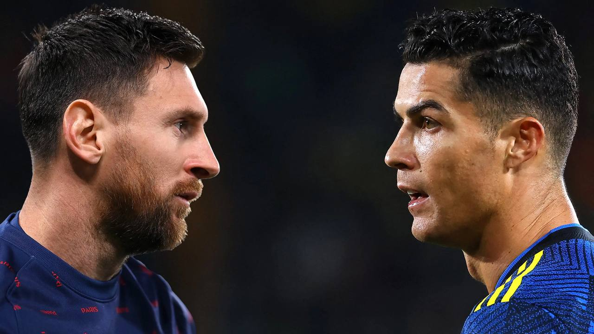
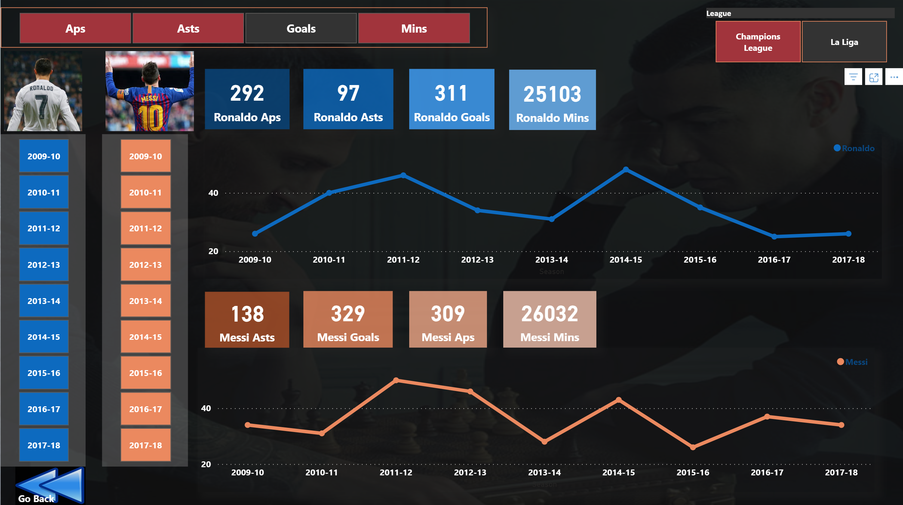

## Messi VS Ronaldo: A Comparative Analysis

Between the years 2010 and 2018, the football world was treated to an incredible rivalry between two of the greatest players in the sport's history: Lionel Messi and Cristiano Ronaldo. This period saw both players deliver remarkable performances in both the UEFA Champions League and La Liga.

# Champions League Dominance:

In the Champions League, Messi led Barcelona to four semi-finals, two finals, and two victories in the 2010-11, 2014-15, and 2015-16 seasons. During this period, he scored an astounding 56 goals and provided 23 assists, including an unforgettable 9 goals in the 2011-12 season. Meanwhile, Ronaldo secured four Champions League titles with Real Madrid, amassing an astonishing 105 goals and 33 assists. His penchant for scoring crucial goals in the finals in 2014, 2016, and 2017, including a memorable brace in the 2017 final against Juventus, solidified his legacy.

# La Liga Battle:

In La Liga, Messi and Ronaldo engaged in a fierce competition for the Pichichi trophy, awarded to the league's top scorer. Between 2010 and 2018, they dominated this accolade, with Messi winning it seven times and Ronaldo three times. In the league itself, Messi triumphed five times, while Ronaldo clinched the title twice.

# Comparing Legends:

Assessing who the superior player was during this era is a challenging task. Messi's brilliance was more concentrated in the Champions League, while Ronaldo displayed remarkable consistency and prolific scoring in La Liga. Moreover, Ronaldo's four Champions League victories set him apart. Each possessed unique strengths that made them incomparable. The question of who was the better player ultimately comes down to personal opinion and preference.

This analysis pays homage to two footballing legends who transcended the sport and created unforgettable moments for fans worldwide. The Messi vs. Ronaldo debate remains a testament to the incredible talent and dedication of these iconic players.

*Insert relevant screenshots in the respective sections to illustrate the statistics mentioned.

